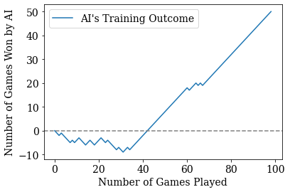

# Nim Game

The demo is available at http://algebragamification.com:3032/.

## Description

A classical two-player Nim game that uses a single layer neural network 
model with crowdsourcing. This game requires two players to take 
alternating turns to choose a number of stones to remove from an initial 
pile, and the player who takes the last stone loses the game.



The figure illustrates the training process and the number of game trials needed for our Nim game AI
to learn a skillful strategy using a single-layer neural network and crowdsourcing.
## Citing

Please cite our work if you have used our codes.

Use the following BibTeX citation:

```
@inproceedings{chatbotserver2022,
title={A Chatbot-Server Framework for Scalable Machine Learning Education through Crowdsourced Data,
author={Jingting Li and Chee Wei Tan and Ching Nam Hang and Xintong Qi},
  booktitle={Proceedings of the Ninth ACM Conference on Learning@ Scale},
  year={2022}
}
```


